> [!INFO] Conexiones de la Red
> [[000_Indice]] • [[Eje_Algebra]] • [[Eje_Quimica]]

> [!ABSTRACT] Subíndice del Eje
> **Etapa 1** — [[Anm_Funciones]] → [[Anm_Limites_Continuidad]] → [[Anm_Derivadas]] → [[Anm_Aplicaciones_Derivada]] → [[Anm_Integrales]] → [[Anm_Aplicaciones_Integral]] → [[Anm_Sucesiones_Series]]
> **Etapa 2** — [[Anm_Funciones_Varias_Variables]] → [[Anm_Derivadas_Parciales]] → [[Anm_Extremos]] → [[Anm_Integrales_Multiples]] → [[Anm_Campos_Integrales_Linea]] → [[Anm_Integrales_Superficie]]
> **Etapa 3** — [[Anm_Ecuaciones_Diferenciales]] → [[Anm_Transformada_Laplace]]
> **Etapa 4** — [[Anm_Variable_Compleja_Fourier]]

# Eje: Análisis Matemático

## Índice

==toc==

---

Eje continuo que agrupa Análisis Matemático I, II, III y IV en una secuencia unificada. El cálculo es el lenguaje de la ingeniería — modelás fenómenos físicos, optimizás sistemas, resolvés ecuaciones que describen el mundo real.

---

## ¿Qué es y para qué sirve?

El Análisis Matemático estudia el **cambio y la acumulación continua**. Construye los conceptos de:

- **Límite** → base de todo lo demás. Te permite hablar de tendencias, aproximaciones y lo que pasa "cuando te acercás".
- **Derivada** → **cambio instantáneo**. Velocidad, pendiente, crecimiento, optimización.
- **Integral** → **acumulación continua**. Áreas, volúmenes, trabajo, energía, flujo.
- **Series** → aproximar funciones, resolver ecuaciones, modelar señales.
- **Ecuaciones diferenciales** → **la física misma**. Casi toda ley física es una EDO o EDP.
- **Variable compleja y Fourier** → procesamiento de señales, control, comunicaciones, vibraciones.

> [!NOTE] Filosofía del eje
> Agarralo como un continuo: cada tema se apoya en el anterior. No hay saltos, hay escalones.

---

## Biblioteca

### Libros de referencia (Análisis I — Cálculo en una variable)

| Autor | Título | Editorial | Ubicación en Raw |
|-------|--------|-----------|------------------|
| Stewart | Cálculo de una variable (6a ed.) | Cengage | `Raw/.../AnM1/libros/Calculo una Variable Stewart 6a edición.pdf` |
| Rogawski | Cálculo: una variable | Reverté | `Raw/.../AnM1/libros/Jon Rogawski - Cálculo _ una variable-Reverté (2016).pdf` |
| Larson | Cálculo 1 de una variable | McGraw-Hill | `Raw/.../AnM1/libros/Ron Larson, Bruce Edwards - Cálculo 1 de una variable-McGraw-Hill (2010).pdf` |
| Salas, Etgen, Hille | Calculus: One and Several Variables (10a ed.) | Wiley | `Raw/.../AnM1/libros/Saturnino L. Salas, Garret J. Etgen, Einar Hille - Calculus_ One and Several Variables, 10th Edition  -Wiley (2006).pdf` |
| Stewart/Redlin/Watson | Precálculo: matemáticas para el cálculo | Cengage | `Raw/.../AnM1/libros/Precálculo_ matemáticas para el cálculo - James Stewart_ Saleem Watson_ Lothar Redlin -Cengage (2017).pdf` |

### Libros de referencia (Análisis II — Cálculo en varias variables)

| Autor | Título | Editorial | Ubicación en Raw |
|-------|--------|-----------|------------------|
| Stewart | Cálculo de varias variables | Cengage | `Raw/.../1 matematica/TEORIA/Análisis matemático II/stewart cálculo de varias variables.pdf` (y `Raw/.../1 matematica/TEORIA/Análisis matemático II/Cálculo de varias variables - Stewart.pdf`) |
| Larson | Cálculo 2 de varias variables | McGraw-Hill | `Raw/.../1 matematica/TEORIA/Análisis matemático II/Calculo 2 de varias variables larson.pdf` |
| Zill | Cálculo de varias variables | McGraw-Hill | `Raw/.../1 matematica/TEORIA/Análisis matemático II/Calculo de varias variables. Zill.pdf` |

### Libros de referencia (Análisis III — Ecuaciones Diferenciales)

| Autor | Título | Editorial | Ubicación en Raw |
|-------|--------|-----------|------------------|
| Zill | Ecuaciones diferenciales | Cengage | `Raw/.../1 matematica/TEORIA/Análisis matemático III/Ecuaciones-diferenciales-Dennis-G.-Zill.pdf` |
| Carmona Jover | Ecuaciones diferenciales | Pearson | `Raw/.../1 matematica/TEORIA/Análisis matemático III/Ecuaciones-diferenciales-Isabel-Carmona-Jover.pdf` |
| Edwards/Penney | Ecuaciones diferenciales | Pearson | `Raw/.../1 matematica/TEORIA/Análisis matemático III/edwards-ecuaciones-diferenciales.pdf` |

### Libros de referencia (Análisis IV — Variable Compleja y Fourier)

| Autor | Título | Editorial | Ubicación en Raw |
|-------|--------|-----------|------------------|
| Churchill | Complex Variables and Applications | McGraw-Hill | `Raw/.../1 matematica/TEORIA/Análisis matemático IV/complex variables and applications.pdf` |
| — | Fourier Transforms: Principles and Applications | Wiley | `Raw/.../1 matematica/TEORIA/Análisis matemático IV/Fourier/Fourier transforms Principles and Applications - PDF Room.pdf` |
| — | Fourier Series and Boundary Value Problems | — | `Raw/.../1 matematica/TEORIA/Análisis matemático IV/Fourier/Fourier-series-and-boundary-value-problems.pdf` |

### Resúmenes y material auxiliar

| Material | Ubicación |
|----------|-----------|
| Resumen completo AnM I (HTML) | `Raw/.../AnM1/Analisis_Matematico_I_Resumen_Completo (1).html` |
| Guía completa AnM I (HTML) | `Raw/.../AnM1/analisis_matematico_I_guia_completa.html` |
| Resumen coloquio AMI (PDF) | `Raw/.../1 matematica/TEORIA/Análisis matemático I/Resumen coloquio AMI.pdf` |
| Tabla de derivadas e integrales | `Raw/.../AnM1/Teorías/Tabla-Derivada-Integral.pdf` |
| Hoja de Fórmulas (LaTeX) | `Raw/.../1 matematica/TEORIA/Hoja de Fórmulas (LaTeX).pdf` |

---

## Hoja de ruta de temas

> [!NOTE] Navegación entre temas
> Cada tema tiene callouts `[!NOTE]` al inicio y al final con enlaces al anterior y siguiente. Seguilos en orden.

### Etapa 1: Fundamentos del Cálculo (Análisis I)

Conceptos básicos de variable real: funciones, límites, derivación, integración y series.

| # | Tema | Descripción | TPs relacionados |
|---|------|-------------|------------------|
| 1 | [[Anm_Funciones]] | Dominio, rango, composición, inversa, paramétricas, polares, trigonométricas | TP0, TP1 |
| 2 | [[Anm_Limites_Continuidad]] | Límites laterales, infinitos, asíntotas, continuidad, discontinuidades | TPN°2, TPN°3 |
| 3 | [[Anm_Derivadas]] | Definición, reglas, regla de la cadena, derivación implícita, logarítmica, razón de cambio | TP4 |
| 4 | [[Anm_Aplicaciones_Derivada]] | Extremos, TVM, L'Hôpital, Taylor, estudio de curvas, optimización | TP5 |
| 5 | [[Anm_Integrales]] | Integral indefinida, definida, TFC, técnicas de integración (sustitución, partes, fracciones simples, trigonométricas) | TP6 |
| 6 | [[Anm_Aplicaciones_Integral]] | Área entre curvas, volumen (discos/arandelas/capas), longitud de arco, integrales impropias | TP7 |
| 7 | [[Anm_Sucesiones_Series]] | Sucesiones, series numéricas, criterios de convergencia, series de potencias, Taylor/Maclaurin | TP8 |

### Etapa 2: Cálculo en Varias Variables (Análisis II)

Extension a ℝⁿ: funciones vectoriales, derivación parcial, extremos, integrales múltiples y teoremas vectoriales.

| # | Tema | Descripción | TPs relacionados |
|---|------|-------------|------------------|
| 8 | [[Anm_Funciones_Varias_Variables]] | Paramétricas, curvas/superficies de nivel, FVV, límite y continuidad en ℝⁿ | TP1, TP2, TP3 |
| 9 | [[Anm_Derivadas_Parciales]] | Derivadas parciales, diferenciabilidad, plano tangente, regla de la cadena, derivada direccional, gradiente | TP4, TP5, TP6 |
| 10 | [[Anm_Extremos]] | Extremos locales/globales, Hessiana, clasificación, multiplicadores de Lagrange | TP7 |
| 11 | [[Anm_Integrales_Multiples]] | Integración doble y triple, coordenadas polares, cilíndricas, esféricas, Jacobiano, aplicaciones | TP8, TP9 |
| 12 | [[Anm_Campos_Integrales_Linea]] | Campos vectoriales, trabajo, integrales de línea, teorema de Green, campos conservativos | TP10, TP11 (David Allmang) |
| 13 | [[Anm_Integrales_Superficie]] | Integrales de superficie, teorema de Stokes, teorema de la divergencia (Gauss) | TP11, TP12, TP13 |

### Etapa 3: Ecuaciones Diferenciales (Análisis III)

Modelado dinámico con EDO y transformadas.

| # | Tema | Descripción | TPs relacionados |
|---|------|-------------|------------------|
| 14 | [[Anm_Ecuaciones_Diferenciales]] | EDO 1er orden, EDO lineales n-ésimo orden, sistemas de EDO, aplicaciones (mezclas, circuitos, resortes) | TP1–TP6 (Cecilia Ferrari) |
| 15 | [[Anm_Transformada_Laplace]] | Transformada de Laplace, transformada inversa, teoremas de traslación, convolución, solución de EDO, función escalón/Delta | — |

### Etapa 4: Análisis Avanzado (Análisis IV)

Variable compleja, series y transformadas de Fourier.

| # | Tema | Descripción | TPs relacionados |
|---|------|-------------|------------------|
| 16 | [[Anm_Variable_Compleja_Fourier]] | Funciones analíticas, integrales complejas, teorema de residuos, series de Fourier, transformada de Fourier, EDP (calor/onda) | — |

---

## Correlatividades conceptuales

```mermaid
flowchart LR
    A[Funciones] --> B[Límites y Continuidad]
    B --> C[Derivadas]
    C --> D[Aplicaciones Derivada]
    D --> E[Integrales]
    E --> F[Aplicaciones Integral]
    F --> G[Sucesiones y Series]

    G --> H[Funciones Varias Variables]
    H --> I[Derivadas Parciales]
    I --> J[Extremos]
    J --> K[Integrales Múltiples]
    K --> L[Campos e Integrales de Línea]
    L --> M[Integrales de Superficie]

    M --> N[Ecuaciones Diferenciales]
    N --> O[Transformada de Laplace]

    O --> P[Variable Compleja y Fourier]
```

> [!NOTE] Relación con otros ejes
> - **Álgebra** → [[Eje_Algebra]] — matrices, vectores y autovalores son prerequisitos para Análisis II y III.
> - **Física** → las EDO y las integrales múltiples aparecen constantemente.
